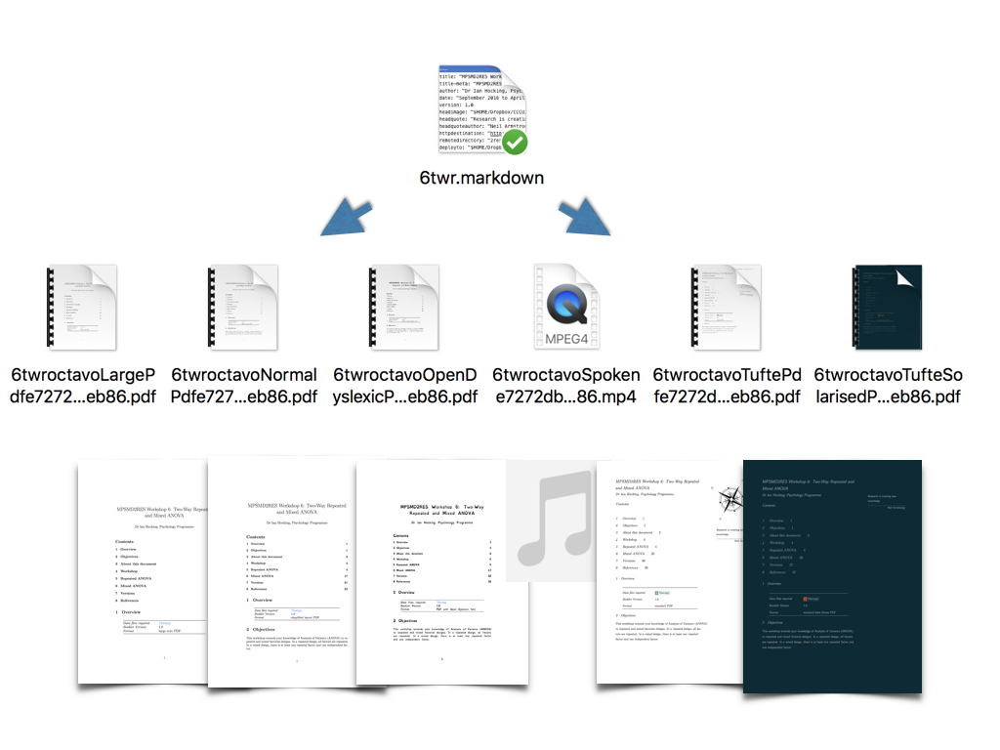

# Octavo

Create well-presented documents, in different formats like [this](examples/deployed/6twroctavoTuftePdfe7272db78832d4744dd6685c80dceb86.pdf), from a single [Markdown](https://en.wikipedia.org/wiki/Markdown) source. (Note: There seems to be a GitHub issue where rendering PDFs on iOS devices fails; check out Octavo outputs on [Dropbox](https://www.dropbox.com/sh/54j75ji2kbwpgka/AACKPuHeUVMVR_l_dmYoj_9ea?dl=0).)

Why does it exist? As a [psychology lecturer](https://www.canterbury.ac.uk/social-and-applied-sciences/psychology-politics-and-sociology/staff/Profile.aspx?staff=e0fe64b03fece667), I wanted a way to write statistics workshop booklets in Markdown (without all that tedious mucking around in Latex) and have my computer produce multiple versions, insert commonly-used text, grab calendar items (like a week-by-week breakdown of teaching sessions) and drop them into the document, run arbitrary UNIX commands and pipe their output into the final documents, as well as do the usual stuff like produce a References section in APA style and handle equations well. I also wanted it to last for several years, if not decades. I did the former. We'll see about the latter. 

This tool has been developed on macOS (Yosemite) but should be easily portable to other UNIX-like operating systems such as Linux. I've very happy to accept pull requests.

This repository contains the handouts from my Level 5 statistics module in Psychology, MPSMD2RES, both as Markdown source and Octavo-produced documents, so you can see what Octavo does.

## Warning

This software is provided as-is. It works on my system, but it might hose yours.

The script has taken me a while to get up and running. I started from a position of wanting something like Octavo, then I set out to build it. I've learned a lot along the way. There's no spaghetti code as such, but my shell programming has improved a great deal, and I wouldn't write the code quite like this if I were starting from scratch. 

## Features

Octavo is a tool for multiple document deployment.

1. Template-based

2. Produces any document (PDF, HTML, .Docx, spoken word etc.) using the excellent [pandoc](http://pandoc.org) and Octavo-specific templates, and inserts live links to these alternative versions

3. Mark sections as redacted; these can either be included in the final document or not

4. Common text can be inserted from any external text file

5. Include the output of arbitrary shell commands

6. [Latex equations](https://www.sharelatex.com/learn/Mathematical_expressions) are supported without a problem; as are [standard citations](https://www.sharelatex.com/learn/Bibliography_management_with_bibtex)

7. If you've got sessions---for example, workshop sessions---in your calendar and want to include these in your final documents, you can do that

8. Octavo will, if asked, FTP all document versions to a web server, so that all that the reader of an Octavo document needs to do is click a hyperlink to get a different version of the document. (Note that the ftp command on macOS, and other Unix-like systems, will draw upon settings contained in your [.netrc](http://www.mavetju.org/unix/netrc.php) file.)

## Installing

1. Install the dependencies (see below)

2. Download the above files (either individually or by [cloning this repository](https://git-scm.com/book/en/v2/Git-Basics-Getting-a-Git-Repository))

3. For convenience, you probably want to have octavo.zsh in your [PATH](https://en.wikipedia.org/wiki/PATH_(variable))

4. Put .octavoConfig in your home folder

5. Put .octavoNewDefaults in your home folder

6. Move the file deployConfig, and the folders includes, media, skeletons and templates to somewhere convenient. I've put them in ~/Dropbox/cccu/text/deploy on my system, but you can set this variable in .octavoConfig.sh

## Usage

~~~

octavo.zsh [markdown file]

~~~

## Setup

Your Markdown file should have a wodge of [YAML](https://en.wikipedia.org/wiki/YAML) at the top that follows the examples in the examples folder. Have a look at each setting and tweak to suit your needs. These YAML settings will be applied to document in which it is found.

.octavoNewDefaults.sh is used by the script octavoNew.sh to generate new Markdown documents that conform to the Octavo conventions.

.octavoConfig contains global preferences that change how Octavo behaves. Again, have a look over these and tweak as you see fit.

deployConfig contains individual Pandoc commands for each of the currently supported output documents.

The folder includes contains text files that can be included in your document if you request it.

The folder media contains pictures for inclusion in the document.

The folder skeletons is used by the script octavoNew.sh to create new Octavo-compliant Markdown files.

The folder templates contains Pandoc templates modified to work with Octavo.

## Features in More Detail

To see an example, check out the source Markdown of my sixth workshop booklet, (examples/markdown/6twr.markdown).

### Ready-to-use templates

(If you have problems viewing the files below, see my [Dropbox](https://www.dropbox.com/sh/54j75ji2kbwpgka/AACKPuHeUVMVR_l_dmYoj_9ea?dl=0).)

 
| Template                                                                                                        | Notes                                                                                                          |
|-----------------------------------------------------------------------------------------------------------------|----------------------------------------------------------------------------------------------------------------|
| [Tufte (the version I give students)](examples/deployed/6twroctavoTuftePdfe7272db78832d4744dd6685c80dceb86.pdf) | A style that loosely follows the design philosophy of Edward R. Tufte                                          |
| [Standard PDF](examples/deployed/6twroctavoNormalPdfe7272db78832d4744dd6685c80dceb86.pdf)                       | A simple PDF, lacking some of the bells and whistles of Tufte                                                  |
| [PDF with large text](examples/deployed/6twroctavoNormalPdfe7272db78832d4744dd6685c80dceb86.pdf)                | Like ‘Standard PDF’, but with a large font                                                                     |
| [PDF with OpenDyslexic font](examples/deployed/6twroctavoOpenDyslexicPdfe7272db78832d4744dd6685c80dceb86.pdf)   | Like ‘Standard PDF’, but with an Open Dyslexic font                                                            |
| [Solarised PDF](examples/deployed/6twroctavoTufteSolarisedPdfe7272db78832d4744dd6685c80dceb86.pdf)              | Like ‘Standard PDF’ but using the Solarized colour scheme                                                      |
| [Spoken (MP4)](examples/deployed/6twroctavoSpokene7272db78832d4744dd6685c80dceb86.mp4)                          | Audio file of the text, suitable for podcasting etc.                                                           |
| [Tufte book (special)](examples/deployed/0allBookletsoctavoTufteBookPdf.pdf)                                    | Produce a Tufte 'book'                                                                                         |

### Hyperlinks to other versions of the file

If you insert the following in the Markdown file:

~~~

& deployments &

~~~

...Octavo will insert a 'smart' paragraph telling the reader that other versions of the file are available. The alternative versions are hyperlinked.

### Version

Insert the version number (specified using the version variable in the YAML).

~~~
& version &
~~~

### Arbitrary commands

Enclose as follows, and the standard output of the command will be piped into the document:

~~~
&cmd date +%D cmd&
~~~

### Include text from external sources

Mark the line with the ampersand character to have Octavo fetch external text using the following text as the filename. Look at the example below.

~~~

&& ianHockingContact

~~~

This will insert the text contents of the file ianHockingContact.markdown. The path to include files is contained in .octavoConfig.sh

### PopOut

To emphasise individual words, use the PopOut class.

~~~
The deadline for this is 25 Novemeber 2016.
~~~

### Answer Box, Task, Journal, and Highlight

To place special formatting around an answer box (showing answers), task (asking the reader to do something), journal (asking them to write in their journal) or highlight (remind them of something important), use the following:

~~~

Significant.

~~~

'Answer' is a special class. When you ask for redacted versions to be produced, Octavo will omit text with this class.

Octavo will create the necessary Latex for PDF documents, while at the same time pre-processing the div into an appropriate format (creating a subheader based on the class; these are hardcoded in octavo.zsh).

The id tag above provides an emphasised text element above the text ('Text here' in the example) for simplified PDF layouts.

## Tables

Octavo can use the [pandoc-tabletocsv](https://github.com/baig/pandoc-csv2table) filter to create tables from csv. Otherwise, standard Markdown tables can be included.

## Issues

At the moment, it isn't possible to use Markdown images within \<div\> tags because Latex figures can't be contained within \\tcolorbox environments.

## Roadmap

- Create a installer for Homebrew

- Re-write using Python, or at least move away from ZSH

## Dependencies

I believe the list below is accurate. If you're installing and find something missing, do please let me know.

- [Pandoc](http://pandoc.org)

- (For scraping events from your Mac calendar and inserting dumping in a .CSV) [iCalBuddy](http://hasseg.org/icalBuddy/)

- A Latex package like [MacTex](https://en.wikipedia.org/wiki/MacTeX) 

- For the OpenDyslexic document, the [OpenDyslexic font](http://opendyslexic.org)

## Acknowledgements

Thanks to [John Gruber](http://daringfireball.net) for creating Markdown and [John MacFarlane](http://johnmacfarlane.net) for creating Pandoc, as well as the authors of the other bits and pieces that Octavo depends upon.

## History

### Version 0.1.0

Initial release.
