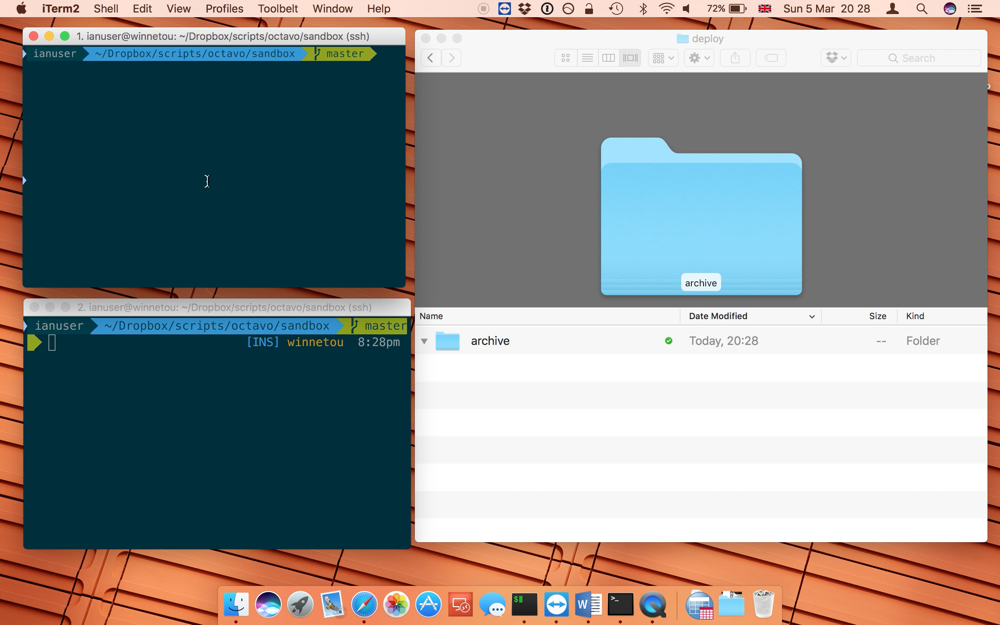
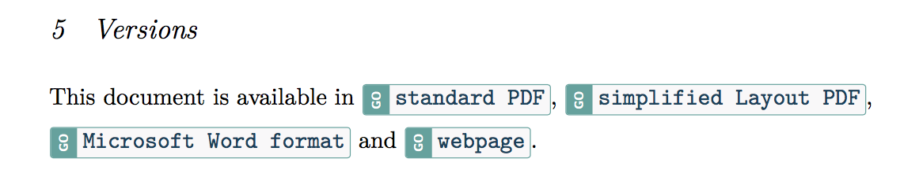
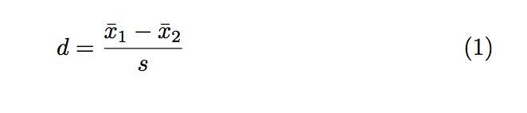

# Octavo v 1.0

Go from a single [Markdown](https://en.wikipedia.org/wiki/Markdown) source file to well-presented documents like [this](sandbox/deploy/1art_dff3df720cb5023bc29b12d1694d6b1coctavoTuftePdf.pdf). Octavo is a wrapper for the excellent [pandoc](http://pandoc.org/).

If you're producing finished-product documents like PDFs or HTML from a text source such as Markdown, you'll need two things: (a) a way of crafting your Markdown files to exploit certain features like highlight boxes and including external text snippets, and (b) nice templates that take advantage of these features. Octavo supplies the (a) and (b).

Why does it exist? As a [psychology lecturer](https://www.canterbury.ac.uk/social-and-applied-sciences/psychology-politics-and-sociology/staff/Profile.aspx?staff=e0fe64b03fece667), I wanted a way to write statistics workshop booklets in Markdown (without all that tedious mucking around in Latex) and have my computer produce multiple versions, insert commonly-used text, as well as do the usual stuff like produce a References section in APA style. And handle equations. I also wanted it to last for several years, if not decades. I did the former. We'll see about the latter. 

This tool has been developed on macOS (Yosemite) but should be easily portable to other UNIX-like operating systems such as Linux. I'm very happy to accept pull requests.

## In Action

## Features

Octavo is a tool for multiple document deployment.

1. Use templates for specific readers (large text, dark background, etc.)

2. Produce any document type (PDF, HTML, .Docx, spoken word etc.) using the excellent [pandoc](http://pandoc.org). Octavo can upload all versions to web server and insert smart text in all documents with appropriate hyperlinks, like this:

3. You can mark sections as redactable, then set a [Yaml](https://en.wikipedia.org/wiki/YAML) field in the Markdown file telling Octavo either show redacted content or hide it. Like this:

`redact: false`

4. Include text from other files, like:

`<include>licence</include>`

5. Put text in boxes. Because my usage is for students, I've got 'task', 'journal' and 'highlight'. Like this:

`<task>`
`Run the analysis`
`</task>`

6. [Latex equations](https://www.sharelatex.com/learn/Mathematical_expressions) are supported without a problem; as are [standard citations](https://www.sharelatex.com/learn/Bibliography_management_with_bibtex). In this example, the equation is Cohen's D, which is described by the part between \$\$ and \$\$; the part in curly brackets will label this as an equation (you then provide lists of equations; or tables, or figures):

> $$ d=\frac{\bar{x}_{1}-\bar{x}_{2}}{s}  $$ {#eq:cohensD}

Which gets you:

## Installing

1. Install the dependencies (see below)

2. Download the above files (either individually or by [cloning this repository](https://git-scm.com/book/en/v2/Git-Basics-Getting-a-Git-Repository))

### Installation

Install, if you haven't already, [a full LaTeX distribution](https://www.latex-project.org/get/), [the Haskell platform](https://www.haskell.org/platform/), [Cabal](https://www.haskell.org/cabal/download.html), and install [Pandoc using Cabal](http://pandoc.org/installing.html). Also via Cabal, install Pandoc filters [pandoc-csv2table](https://github.com/baig/pandoc-csv2table), [pandoc-crossref](https://github.com/lierdakil/pandoc-crossref), [pandoc-citeproc](https://hackage.haskell.org/package/pandoc-citeproc). Finally, install [Python3-pip](https://community.c9.io/t/how-to-install-pip-for-python3/3196/4) and use pip3, which you've just installed, to itself install [pandocfilters](https://github.com/jgm/pandocfilters/blob/master/README).

Notes:

- The above installation works for macOS Yosemite and Ubuntu 16.04.2

- LaTeX and Haskell (and Cabal) are huge

- On Ubuntu, I had a persistent Cabal installation fail that I managed to fix with the [following advice](http://stackoverflow.com/questions/20769183/cabal-update-failed-due-to-out-of-memory)

## Usage

~~~
 
octavo.sh -f <file> [-c <file>] [-ybvdhn]

-f --file [arg]    Markdown file to process. Required.
-b --bash          Print Bash variables to standard output
-c --config [arg]  Specify a configuration Yaml file. Default is .octavoConfig.yml in the script directory.
-d --debug         Enables debug mode
-n --no-color      Disable color output
-o --output        Print processed Markdown
-p --pandocverbose Verbose Pandoc output to standard output
-u --dummy         Dummy run
-v --verbose       Enable verbose mode; print script as it is executed
-y --yaml          Print Yaml of Markdown file to standard output
-h --help          This page

~~~

## Setup

Your Markdown file should have a wodge of [YAML](https://en.wikipedia.org/wiki/YAML) at the top that follows the example in the examples folder. Have a look at each setting and tweak to suit your needs. These YAML settings will be applied to document in which it is found.

### Files

- .octavoConfig.yml: Contains global preferences and information about templates

- /templates/documentDefault.yml: Common document properties that you might want to include in your Yaml header.

- octivate.markdown: A minimal working example Yaml header.

### Folders

- filters: Pandoc filters, modified for use with Octavo. They are named in .octavoConfig.yml

- includes: Octavo will look here for text you wish to include dynamically. Use <include>filename</include> to do this.

- media: Graphics to be used, such as header images.

- sandbox: Here you'll find an advanced document called 1art.markdown, which uses several Octavo features.

- templates: Octavo-styled Pandoc templates.

## Vim

If you use Vim like me, you might find the following useful. Note that I'm launching Octavo on the current document using a plugin called [asyncrun](https://github.com/skywind3000/asyncrun.vim), which permits it to run in the background. 

Use :Octavo to run Octavo on the current document:

`command Octavo AsyncRun ! octavo.sh -f %`

Use :OctavoDebug to do the same, but with debug mode on:

`command OctavoDebugMode AsyncRun ! octavo.sh -f % -d`

For quick access, map your leader key and 'o' to launch Octavo:

`noremap <leader>o :Octavo<CR> " leader-O launches Octavo`

Use :Octivate to add minimal Yaml to the top of your file, just enough to create a minimal Octavo document (note that you'll need to replace '~/Dropbox/Scripts/octavo' with the correct path to your Octavo directory):

`command Octivate 0r ~/Dropbox/Scripts/octavo/octivate.markdown`

## Roadmap

- Create a installer for Homebrew

## Acknowledgements

Thanks to [John Gruber](http://daringfireball.net) for creating Markdown and [John MacFarlane](http://johnmacfarlane.net) for creating Pandoc, as well as the authors of the other bits and pieces that Octavo depends upon.

## Contributing

Happy to look at any contributions, particularly for Latex templates.

## History

### Version 1.1

Uses SFTP instead of FTP, so public key encryption now required.

### Version 1.0

Refactored.

### Version 0.3.0

Support nicer tags like `<task></task>` to denote tasks.

### Version 0.2.0

Add support for Microsoft Word .docx format.

### Version 0.1.1

Fix a bug where entire Deploy directory was uploaded with each FTP operation. Now only new files are uploaded. Significant speed increase.

### Version 0.1.0

Initial release.

